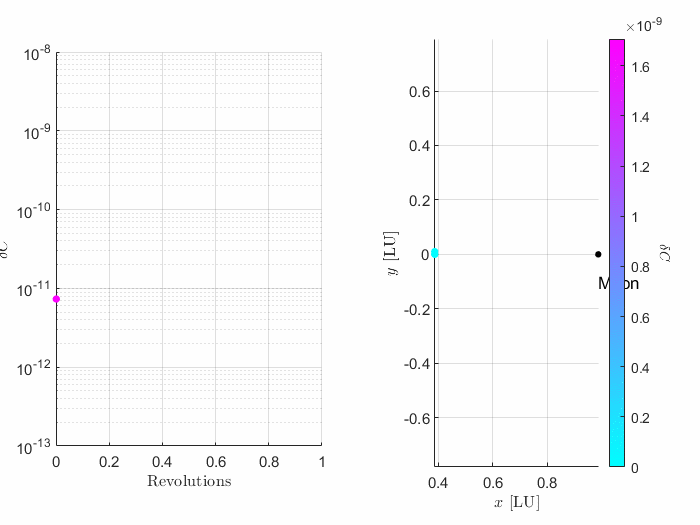

# Explicit Symplectic Integrators

Symplectic integrators are designed to preserve the geometric properties of Hamiltonian systems over long time horizons, offering improved energy stability compared to traditional methods.

This repository implements a modular framework for symplectic integration of dynamical systems, with a focus on orbital mechanics problems such as the Circular Restricted Three-Body Problem (CR3BP) and the Two-Body Problem (TBP). 

The codebase is organized using MATLAB classes for flexibility and extensibility, and includes examples of orbit propagation and visualization. This framework serves as a foundation for exploring more complex systems, such as the Elliptic Restricted Three-Body Problem (ER3BP), and supports future development of additional features and orbit types.

    

## Necessary Software

1. MATLAB (tested with version R2023a).

## Directory Structure

The repository contains the following main files:

- `Example_TBP/Example_TBP.m`: The main script with implementation of propagating a Two-Body Orbit
- `Example_CR3BP/Example_CR3BP.m`: The main script with implementation of propagating a Circular Restricted Three-Body orbit

## References

[1] Soria-Carro, A., Akella, M., “Long-Duration Explicit Symplectic Approximations and Uncertainty Propagation for Cislunar Regimes,” AAS/AIAA Astrodynamics Specialist Conference, Broomfield, CO, August 2024. AAS Paper Number 24-258. 
