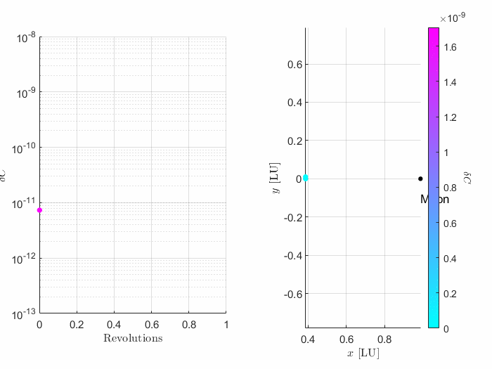

# Explicit Symplectic Integrators

Symplectic integrators are designed to preserve the geometric properties of Hamiltonian systems over long time horizons, offering improved energy stability compared to traditional methods.

This repository implements a modular framework for symplectic integration of dynamical systems, with a focus on orbital mechanics problems such as the Circular Restricted Three-Body Problem (CR3BP) and the Two-Body Problem (TBP). 

The codebase is organized using MATLAB classes for flexibility and extensibility, and includes examples of orbit propagation and visualization. This framework serves as a foundation for exploring more complex systems, such as the Elliptic Restricted Three-Body Problem (ER3BP), and supports future development of additional features and orbit types.

    

## Necessary Software

1. MATLAB (tested with version R2023a).

## Directory Structure

- `lib/+astro/`: dynamical-system classes (`CR3BP`, `ER3BP`, `BCR4BP`, `TwoBody`) and orbital-element conversion utilities (`+conics`)
  - `CR3BP`/`ER3BP` carry the precision ladder as methods alongside `SI_EOM`: `SI_EOM_Expanded`/`SI_EOM_Increment` (uncompensated baselines), `SI_EOM_ICS` (increment + compensated summation), `SI_EOM_CS` (full compensated summation), and — CR3BP only — `SI_EOM_dd`/`SI_EOM_ddInc` (double-double: full closed-form and increment-form respectively). Not yet wired into `SI`/`TimeRegularized` as a selectable `precision` option — that's a follow-up. (Time-regularized compensated-summation kernels, `SI_EOM_TR_ICS`/`SI_EOM_TR_CS`, are deferred for now.)
- `lib/integrators/`: the integrator classes (`SI`, `RK`, `TimeRegularized`, `Integrator`)
- `lib/utils/`: shared numerical helpers -- `comp_sum` (Kahan compensated summation), a double-double arithmetic toolkit (`dd_add`, `dd_sub`, `dd_mul`, `dd_neg`, `dd_recip`, `dd_accum`, `dd_from_double`, `dd2double`, `twoSum`, `quickTwoSum`, `twoProd`, one function per file) used by `SI_EOM_dd`/`SI_EOM_ddInc`, and plotting helpers

Example/driver scripts (`Example_TBP/`, `Example_CR3BP/`, etc.) are still at their original top-level locations pending a separate reorganization pass.

## References

[1] Soria-Carro, A., Akella, M., “Long-Duration Explicit Symplectic Approximations and Uncertainty Propagation for Cislunar Regimes,” AAS/AIAA Astrodynamics Specialist Conference, Broomfield, CO, August 2024. AAS Paper Number 24-258. 
